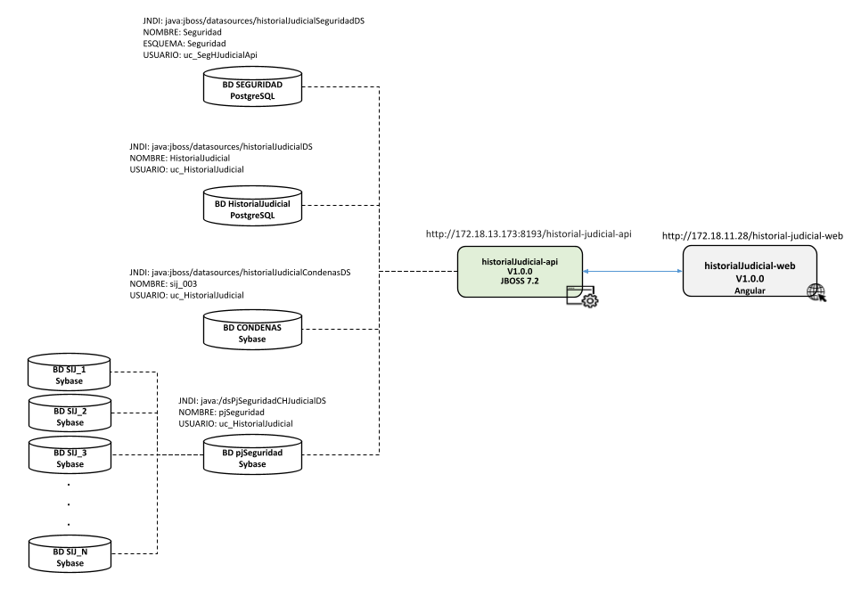

# Módulo de Consulta para Organizaciones Políticas - Fuentes de Financiamiento Prohibidas

Web service que permite consultar condenas y Prision preventiva 

### Requisitos Iniciales

| Herramienta     | Version                           |
|:----------------|:----------------------------------|
| Java            | 1.8.0_231                         |
| Springboot      | 2.5.15                            |
| Maven           | 3.9.8                             |
| Lombok          | 1.18.26                           |

- Configurar Java, Maven y Lombok en una ruta local del espacio de trabajo.

### Contexto del servicio

- /historial-judicial-api

### arquitectura

```
historial-judicial-api/
│
├── historial-judicial-api-api/
│   ├── src/main/java
│   │   ├── pe/gob/pj/hjudicial/api/app
│   │   │   ├── apis                                        # Controladores de la aplicación
│   │   │   ├── exceptions                                  # Excepciones especificas de la aplicación
│   │   │   ├── seguridad                                   # Configuracion de Spring Security
│   │   │   ├── PartidosPoliticosApp.java
│   │   │   ├── ...
│   │   │   │
│   ├── src/main/webapp                                     # Paquete de Configuracion del despliegue en jboss
│   └── pom.xml                                             # Archivo domain de configuración maven
│
├── phistorial-judicial-api-dao/
│   ├── src/main/java
│   │   ├── pe/gob/pj/hjudicial/dao/                       
│   │   │   ├── dto                                         # Clase Dto 
│   │   │   ├── entity                                      # Clase que representan las entidades en las base de datos
│   │   │   ├── procedures                                  # Clase donde se configuran los nombres de los procedimientos almacenados
│   │   │   ├── repocitory                                  # Clase e interfaces para obtener datos de la base datos
│   │   │   ├── utils                                       # Clase utilitarias de la aplicación
│   │   │   ├── ...
│   │   │   │
│   │   ├── pe/gob/pj/pjseguridad/dao/                      # Package donde se configura las conexiones dinamicas a las n cortes
│   │   │   ├── config                       
│   │   │   ├── dto                       
│   │   │   ├── repository                       
│   │   │   ├── ...
│   │   │   │
│   │   ├── pe/gob/pj/pjseguridad/util/                     # Clases utilitarias para pjSeguridad
│   │
│   └── pom.xml                                             # Archivo usecase de configuración maven               
│
├── historial-judicial-api-service/
│   ├── src/main/java
│   │   ├── pe/gob/pj/hjudicial/                            # Package donde va todo referente al manejo de servicios
│   │   │   ├── bean                                        # Clase que representan objetos de los servicios
│   │   │   ├── restclient                                  # Clase de configuración para consumir api rest
│   │   │   ├── service                                     # Clase e interfaces para 
│   │   │   ├── ...
│   │   │   │
│   └── pom.xml                                             # Archivo infraestructure de configuración maven
│
└── pom.xml                                                 # Archivo general de configuración de Maven.

```

### Base de Datos

| Entorno     | Tipo de BD        | Servidor        |Puerto|BD                  |Usuario del Servicio|
|:------------|:------------------|:----------------|:-----|:-----------------------|:--------------------------------|
| Desarrollo  | Sybase            |172.34.0.106     |6000  |pjSeguridad             |uc_HistorialJudicial             |
| Desarrollo  | Sybase            |172.34.0.69      |5000  |sij003                  |uc_HistorialJudicial             |
| Desarrollo  | PostgreSQL        |172.18.11.241    |39969 |seguridad               |uc_HistorialJudicial             |
| Desarrollo  | PostgreSQL        |172.18.11.241    |39969 |historialJudicial       |uc_HistorialJudicial             |     

Tambien se conecta a las n cortes superiores del SIJ de manera dinamica, los datos de conexion como servidor, puerto, usuario, clave se obtienen de la base de datos **pjSeguridad**
con la siguiente consulta sql 

```
	SELECT 
    b.x_descripcion,
    b.x_edicion,
    b.x_nombre,
    b.x_ipServidor,
    b.x_puerto,
    b.n_idBaseDatos,
    ISNULL(b.n_id_bd_estadistica, 0) AS codigo,
    e.x_esquema,
    'com.sybase.jdbc4.jdbc.SybDriver' AS driver,
    cx.x_jndi,
    cx.x_usuario,
    cx.x_clave
FROM uid_seguridad.Mae_BaseDatos b
INNER JOIN uid_seguridad.Mae_Conexion cx 
    ON cx.n_idBaseDatos = b.n_idBaseDatos 
    AND cx.l_estadoRegistro = '1'
INNER JOIN uid_seguridad.Cfg_SistemaConexion scx 
    ON scx.n_idConexion = cx.n_idConexion 
    AND scx.l_estadoRegistro = '1'
INNER JOIN uid_seguridad.Mae_Sistema s 
    ON s.n_idSistema = scx.n_idSistema 
    AND s.l_estadoRegistro = '1'
LEFT JOIN uid_seguridad.Mae_Esquema e 
    ON e.n_idBaseDatos = b.n_idBaseDatos 
    AND e.l_estadoRegistro = '1'
WHERE b.l_estadoRegistro = '1'
    AND cx.x_clave IS NOT NULL
    AND s.x_nombre = 'CHJudicial'
    --AND b.c_distrito = '10'
    AND cx.x_nombre LIKE '%CHJudicial'
ORDER BY b.l_esPrincipal;

```


### Recursos 

+ Los recursos corresponden a los archivo propeties y logs, y se debe ubicar en la carpeta modules/pe/gob/pj/historial-judicial del servidor donde se despliega el proyecto.
```
https://desagit.pj.gob.pe/sdsi/recurso-servicios-in-modules/historial-judicial
```
+ Para obtener los recursos con git bash ejecutar el siguiente comando: 
```
git clone https://desagit.pj.gob.pe/sdsi/consulta-historial-judicial-chjudicial/historial-judicial-api-rest.git
```

### URLs del servicio                         

| Nombre        | Link Url                                                       |
|:--------------|:---------------------------------------------------------------|
|Url Base       |http://172.18.13.173:8193/historial-judicial-api                            |
|Disponibilidad |http://172.18.13.173:8193/historial-judicial-api/healthcheck                  |

### Diagramaa de Integración


